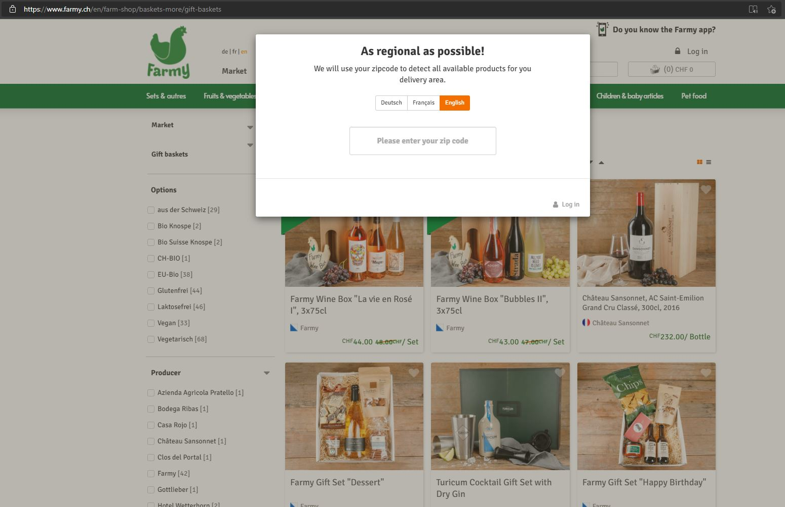

# User control and freedom

Users often choose system functions by mistake and will need a clearly marked “emergency exit” to leave the unwanted state without having to go through an extended dialogue. Support undo and redo.

## Examples

### Teresa 
The website has a pop-up that you cannot ignore or close before you provide a zipcode, making it impossible to enter the website just to browse without giving away any personal information. Preventing the user from interrupting the dialogbox is therefore a good example of a website not following the Nielsen’s heuristics in regards to 'user control and freedom'. 

Additionally, having a fixed dialogbox on the front page of any website is also generally considered bad web design, thus this could also be argued to represent an inconsistency with 'consistency and standards' for good web design, where you should always make it possible for users to cancel or close any dialogbox or unwanted action.

